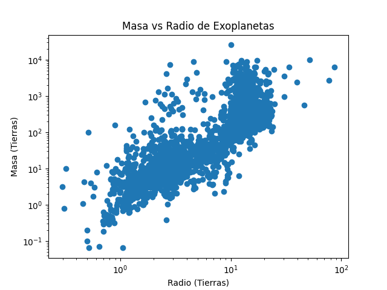

# Proyecto Minería de Datos - Exoplanetas

Pipeline reproducible para el análisi de Masa vs Radio

# Proyecto: Análisis Masa-Radio de Exoplanetas

## 📌 Descripción

Este proyecto implementa un pipeline reproducible para el análisis de datos de exoplanetas provenientes del archivo público de NASA Exoplanet Archive. 

El objetivo es estudiar la relación entre la masa y el radio de los exoplanetas, con el fin de identificar la transición entre planetas rocosos y gigantes gaseosos.

---

## ⚙️ Reproducibilidad

Para ejecutar el proyecto:

```bash
git clone https://github.com/josuedominguez29/trabajo_1_mineria_datos_exoplanetas.git
cd trabajo_1_mineria_datos_exoplanetas
bash pipeline.sh

## 📊 Resultados

